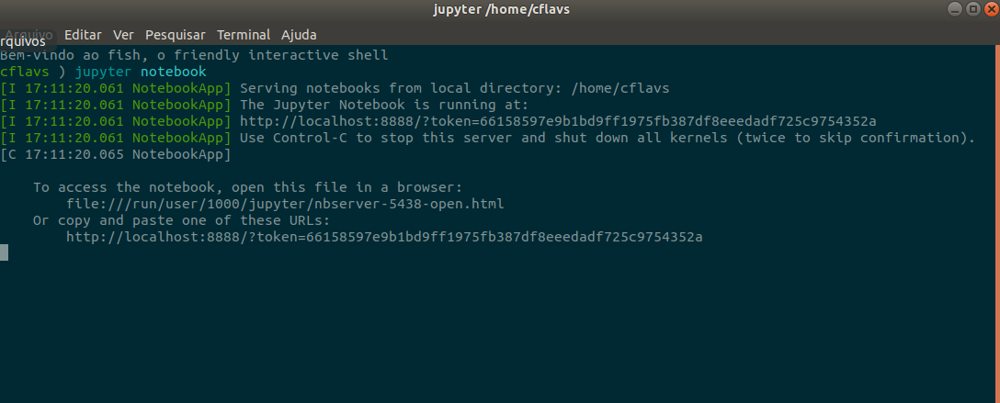

# handson Keras
Repositório destinado ao workshop de Deep Learning: Teoria à Prática utilizando Keras


## Pré-requisitos

O projeto utilizará linguagem de programação Python (versão 3.6) e as bibliotecas inclusas no arquivo requirements.txt

## Instalação

### Linux

Por padrão, o Python já está instalado nesses sistemas, sendo necessário instalar o pip. A instalação do pip varia de acordo com a distribuição Linux utilizada, verifique a distribuição e logo após, abra um terminal, digitando o comando abaixo.

#### Debian/Ubuntu

```
sudo apt-get update
sudo apt install python3-pip
sudo pip install --upgrade pip
```
#### CentOS/RHEL

```
sudo yum update
sudo yum install epel-release
sudo yum install python3-pip
sudo pip install --upgrade pip
```

#### Arch Linux
```
pacman -S python-pip
pip install --upgrade pip
```

#### openSUSE
```
zypper install python3-pip
pip install --upgrade pip	
```

#### Fedora

Para Fedora, é necessário instalar o Python, incluindo assim a instalação do pip.

```
dnf install python3
pip install --upgrade pip
```

Após instalar o pip e Python (se necessário), utilize o comando de instalação abaixo.

```
pip install -r requirements.txt
```

### MacOS

Por padrão, o Python 3.6 está instalado no MacOS, sendo necessário instalar o pip através do comando abaixo.

```
sudo easy_install pip
sudo pip install --upgrade pip
```

Após instalar o pip, utilize o comando de instalação abaixo

```
pip install -r requirements.txt
```

### Windows

Para windows, é necessário instalar o Python através do site da [plataforma](https://www.python.org/downloads/windows/). Para baixar, selecione um executável da versão do Python 3.6.x para Windows de acordo com a arquitetura do computador (32 bits ou 64 bits). Ao abrir o executável, antes de instalar, marque a opção "Add Python 3.6 to PATH", conforme figura abaixo.

  

A instalação do Python também inclui o sistema de gerenciamento de pacotes pip. Assim, após a instalação, abra o terminal do Windows e digite:

```
pip install -r requirements.txt
```

## Utilização

Abra o terminal e clone o repositório através do comando abaixo. Caso não tenha git, instalar através do [site do git](https://git-scm.com/)

```
git clone https://github.com/cflavs/handson_keras.git
```

Após clonar o repositório, uma pasta handson_keras será adicionada no computador local, entre na pasta e abra o terminal para inicializar o Jupyter Notebook através do comando abaixo.

```
jupyter notebook
```

Depois disso, uma janela similar a figura abaixo será aberta no navegador padrão do computador. 


Caso o navegador não abra uma janela, abra o terminal utilizado para inicializar o jupyter e copie a URL no navegador conforme figura abaixo.



Feito isso, pode acessar os notebooks do workhop, sendo estes qualquer arquivo com extensão ipynb. Os notebooks contém descrições e códigos. Para rodar os códigos, selecione a célula e digite shift+enter. 

OBS. As células devem ser rodadas sequencialmente.


## Autor

Cecília Flávia da Silva
Empresa VSOFT 
